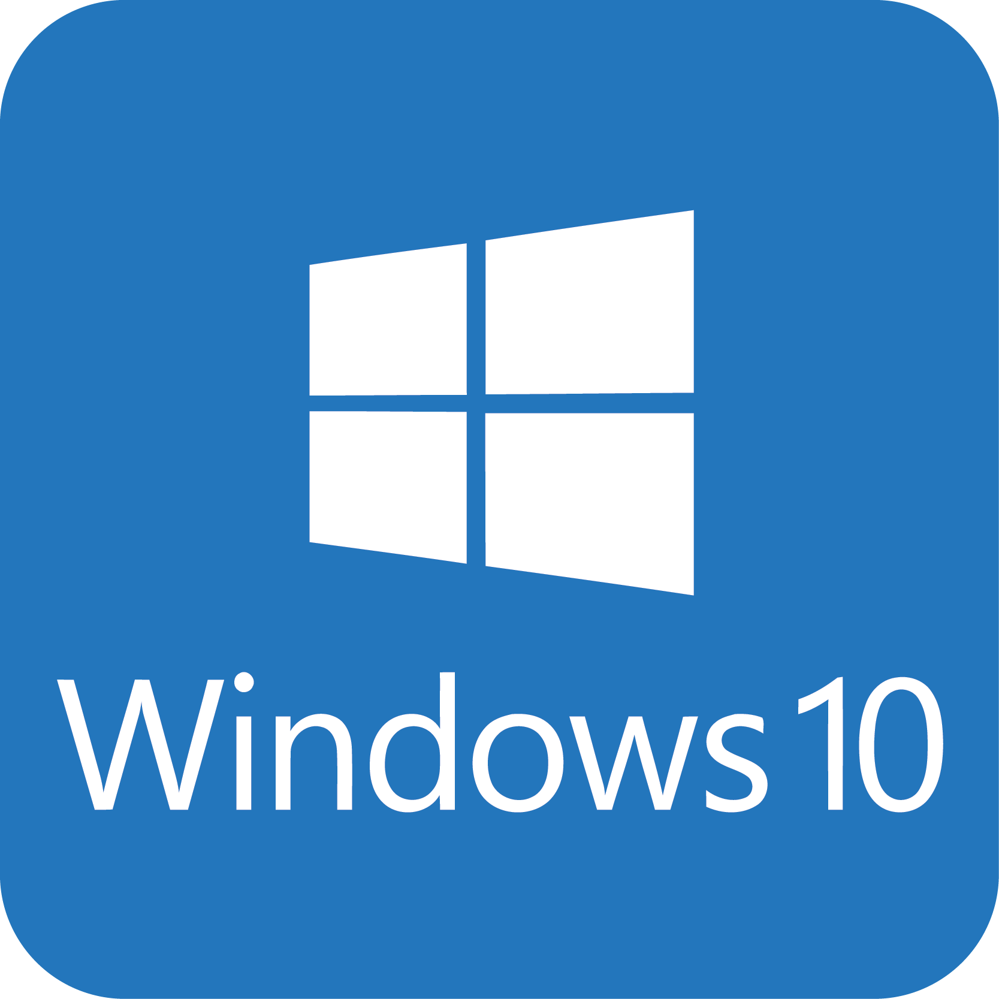

# Hello devs and welcome!

- Before starting our course, you need to configure your machine and install some required settings to make you ready for the course

- Please make sure to read the steps line by line to prevent such problems

- This installation part should take 1 hour or more depending on your internet speed and your machine specification

- You do not need to understand what this process is doing.

<h3> NOTE: Make sure that you have a stable internet connection as you will be asked to download some stuff. </h3>

<h2 align="center"> Please Choose Your System Below</h2>

 <a href="part1.md"><kbd></a> </kbd> &nbsp; &nbsp; &nbsp; &nbsp; <a href="https://ayyoubk.github.io/setup-development-environment/"> <kbd> </kbd></a>

<h2></h2>
