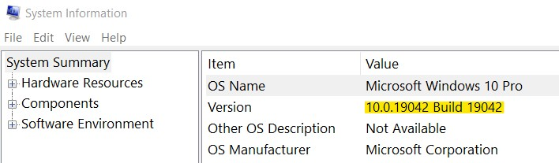

<h1 align="center"> How to install Ubuntu & WSL Version 2 </h1>

## Part 1

### Please follow the instructions line by line carfully:

- before we start the installation part please make sure that you have the latest update for windows 10 in order to make the WSL enviroment to work
- go to your windows search bar and type `system information` to check your OS details and <b> hit ENTER </b>
- look at the Version number as you can see in the image below
 
&nbsp; &nbsp; &nbsp; &nbsp; &nbsp; &nbsp; &nbsp; &nbsp; &nbsp; &nbsp; &nbsp; &nbsp; &nbsp; &nbsp;  <kbd></kbd>

- if it is lower than `19042` then you need to update, if it's the same number then no need to update the windows, we need this because it's required to make the WSL 2 work without any problems

## How to update windows 10 or 11?
- you can go to windows search bar and type `check for updates` and it will redirect you to update the system ( it will take some time to finish so be patient )
- if you are facing some technical issues, download the `update helper tool` from Microsoft from this link <a href="https://go.microsoft.com/fwlink/?LinkID=799445">Windows 10 Update Tool</a>

<hr>

### Now, we need to enable the required services for your machine.
- go to your windows search bar again and type `Turn Windows features on or off` and hit enter, you should see a list of services ( check the image below )


<p align="center"> <kbd></kbd></p>

### now scroll down and check the boxes for:
* `Virtual Machine Platform`
* `Windows Hypervisor Platform`
* `Windows Subsystem for Linux`
* `Hyper-V`

### Not important ( just in case ):
#### if you want to run ubuntu inside a virtual machine ( virtualbox, vmware, etc ) then you need to enable extra service:
* `Containers`


- once you enabled the services click ok and then you are required to RESTART your machine in order to take effect.

### Note:
- sometimes the virtual machine service is DISABLED from your machine, if so, go to your windows search bar, search for cmd.exe and run it as adminstrator and run this command:
```
Enable-WindowsOptionalFeature -Online -FeatureName VirtualMachinePlatform
```
- RESTART your machine if prompted, it should work for you ( if it does SKIP this part below and start from PowerShell )
- if it didn't work, this means that you need to enable Virtualization (VT-x) in Bios, please note this might be differnt from machine to machine but it's the same proccess
1) Reboot your machine and Press the BIOS Key several times to boot. ...
2) Search for the section for CPU configuration Or it could be inside Advanced configurations.
3) Find the Settings for Virtualization or VT-x and hit enter and Change it from DISABLED to ENABLED
4) Exit Your BIOS by pressing F10 and say yes and your machine should be restarted now.
- You can also refer to this vedio for more information about how to enable Virtualization in BIOS <a href="https://www.youtube.com/watch?v=MOuTxfzCvMY">LINK</a>


<hr>

### Now we need to run several commands using PowerShell 
- search for `PowerShell` from windows search bar and open `PowerShell.exe` and run the following commands:
```
dism.exe /online /enable-feature /featurename:Microsoft-Windows-Subsystem-Linux /all /norestart
```
then
```
dism.exe /online /enable-feature /featurename:VirtualMachinePlatform /all /norestart
```
- this will enable Virtual Machine Platform for WSL, if it ask for a restart then restart your machine to continue
---------------------------------------------
### Now you need to install windows subsytem Linux ( used to run the Linux environment on windows )
<h3 align="center">  click on the icon below to download it directly</h3>
<p align="center"> <kbd><a href="https://wslstorestorage.blob.core.windows.net/wslblob/wsl_update_x64.msi"> </a></kbd>
<h3 align="center">windows subsystem linux</h3>
<br>
- after it finishes downloading, open the downloaded file `wsl_update_x64.exe` and follow the setup instructions

---------------------------------------------


# How to install Windows Terminal
- Windows Terminal is an interactive program which allows you to type commands as instructions to control your computer.

<h3 align="center"> Download Windows Terminal by clicking the icon below using Microsoft Store </h3>

<p align="center"> <kbd><a href="https://www.microsoft.com/en-us/p/windows-terminal/9n0dx20hk701?activetab=pivot:overviewtab"> </a></kbd>

- after it's succefully installed open the terminal and run this command to set you enviroment to WSL version 2
```
wsl --set-default-version 2
```
- Now you need to check the WSL version, run the following command in Terminal:
```
wsl -l -v 
``` 
- if you see output like this image then you are good to go
&nbsp; &nbsp; &nbsp; &nbsp; <kbd></kbd>

<hr>

# How to install UBUNTU
- Ubuntu for Windows runs and offer Linux developer tools on Windows.

<h3 align="center"> install UBUNTU by clicking the icon below using Microsoft Store </h3>

<p align="center"> <kbd><a href="https://www.microsoft.com/en-us/p/ubuntu/9nblggh4msv6?activetab=pivot:overviewtab"> </a></kbd>

<hr>

## Now follow these instructions:

- Run Ubuntu after it's done from installing then wait ... you will see a confirmation for a successful installation ( check the image below )

&nbsp; &nbsp; &nbsp; &nbsp; <kbd></kbd>

### Be Carefull about the next step:
- it will ask you to enter a new username: for example "student"
- please note that the password is hidden, so make sure you are setting your password correctly.
- set your password twice to verify it: ( make sure to memorize it ) `hint: use 123456 or 0000`
<br>

## Now we need to update ubuntu profile and create a backup for some files:

### run these commands line by line:
```
mv ~/.bashrc .bashrc.bak
```
```
mv ~/.bash_profile .bash_profile.bak
```
                                                                
```
mv ~/.profile .profile.bak
```
```
mv ~/.zshrc .zshrc.bak
```

- if you get "No such file or directory" error for some of them. don't worry it's NORMAL

<hr>
                                        
- Now run this command in Ubuntu
```
curl -s https://raw.githubusercontent.com/omarXzain/LTUC-ASAC/main/.profile >> ~/.profile
```

- Once it finishes, `COMPLETLY CLOSE UBUNTU` then re-open it again. 
- Your terminal appearance should be changed to a different set of colors and cool features

<hr>

# Reset Your Environment
- The changes you just made will take effect every time you re-open your terminal. But right now, we want to see those changes immediately, so let's "source it" by running:
```
source ~/.profile
```
## NOTE:
- You will see an error similar to this <h4>-bash: /home/linuxbrew/.linuxbrew/bin/brew: No such file or directory </h4>
### This is ok for now, you can continue.

`Close UBUNTU and run it again to take effect`

<hr>

# Installing and Updating the Linux App Manager
### you need to get the latest update for ubuntu to make sure that everything will work without any problems.

- OPEN YOUR Ubuntu then copy-paste the commands line by line!
```
sudo apt-get update
```
- put your password, when prompted ( because we are using sudo )
- once it's done, run this command: ( it will take up to ~  13 mins )
```
sudo apt-get upgrade
```

- Press `Y` when prompted
- Once it's done, run this
```
sudo apt autoremove 
```
- This will remove any packages that are no longer needed.

- and finally install the `Build Essentials` kit with this command: ( it will take up to ~  4 mins )
```
sudo apt-get install build-essential
```
<hr>
<a href="part2.md">MOVE TO PART2</a>
