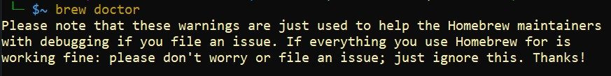

# PART 2
# Install <b> Homebrew </b>
#### Homebrew is a free and open source software package management system that simplifies the installation of software on your machine.

- from your Ubuntu, run this command: ( it could take from 5 to 20 mins )
```
/bin/bash -c "$(curl -fsSL https://raw.githubusercontent.com/Homebrew/install/master/install.sh)"
```
- please note that you will be prompted several times with `yes or no` Accept all the defaults and say `Yes` when prompted

- after it's done, enter these commands, one at a time in your UBUNTU to test the homebrew settings:
```
test -d ~/.linuxbrew && eval $(~/.linuxbrew/bin/brew shellenv)
```
```
test -d /home/linuxbrew/.linuxbrew && eval $(/home/linuxbrew/.linuxbrew/bin/brew shellenv)
```
### it's just for testing the homebrew ( you should not see any result )

<hr>

## Now you will run this command to check the homebrew enviroment if it's ready to use or not.

```
brew doctor
```

- you should see a result like this:
`Your system is ready to brew`
- then you can continue to the next step

## Note:
- if you get this warning below
&nbsp; &nbsp; &nbsp; &nbsp; <kbd></kbd>
- then run the following command ( this error means that we need to update the homebrew to the lastest version )
```
brew update
```
then run the brew doctor again just to make sure
```
brew doctor
```

### Now we need to install `gcc` which is required for the homebrew to install other applications
- to do this run this command in ubuntu: ( it will take up to ~  5 mins)
```
brew install gcc
```

- when it's done you can move to the Node part


<hr>

<a href="part1.md">Previous Page </a></h2> | <a href="part3.md">MOVE TO PART 3 ( Node )</a> 


