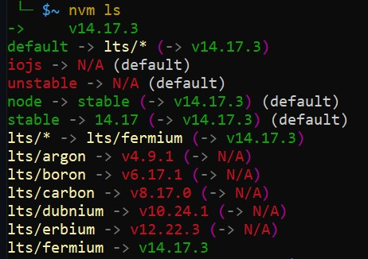
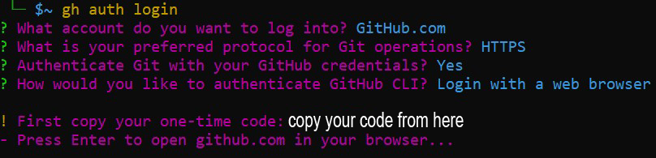
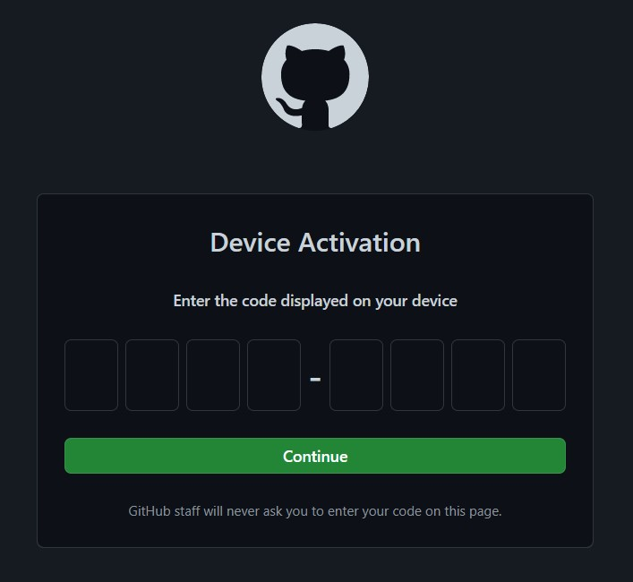
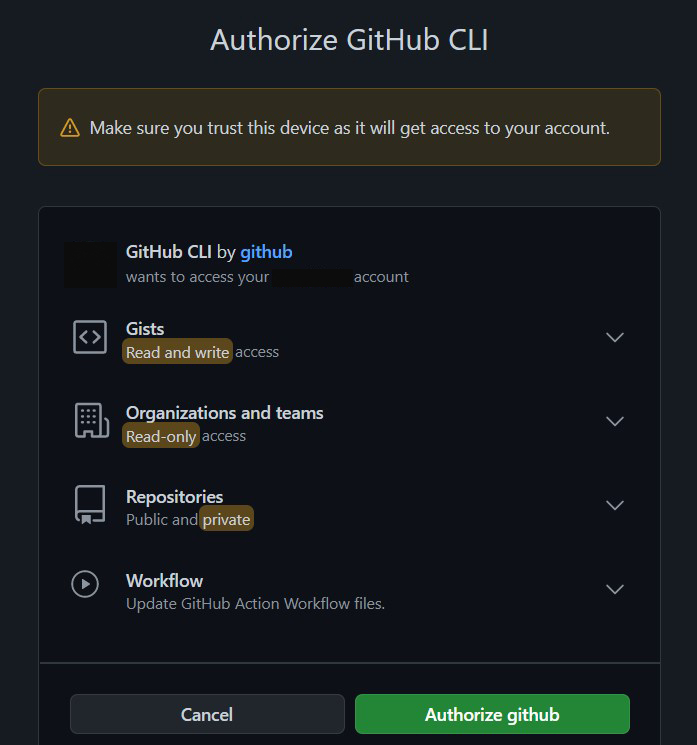
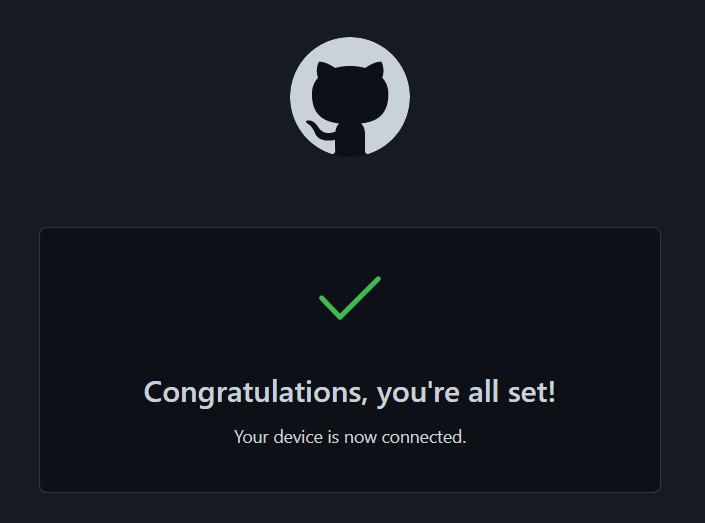

# Part 3
# How to install node:
### we will install Node.js using nvm ( Node Version Manager )
- run this command to install Node Version Manager: ( it will take up to ~  6 mins)

```
brew install nvm
```
- once it's done, we need to `CLOSE UBUNTU` and re-open it again in order to take effect

- Now run this command to install Node: ( This will install the latest stable version of Node.js) ( it will take up to ~  4 mins )

```
nvm install --lts
```
- let's check the node version by running this command:
```
nvm ls
```
- you should see a result similar to this ( v14.17.3 or higher! )
<br> <br> <p align="center"><kbd></kbd></p>

- let's double check the node version by running this command:
```
node --version
```
- the output should be only the node version 
- in our case it's `v14.17.3` ( it's ok if you get higher version )

<hr>

# What is Git?
### a DevOps tool used for source code management to track the changes

## Install and Configure Git and GitHub

- Run the following command ( it will install the latest version ) ( it will take up to ~  3 mins)
```
brew install git || brew upgrade git
```
## Now we need to configure the settings and connect you github account with your machine

### Setup GitHub for "Authentication"

- first, make sure that you already have a github account, if not then create one from here <a href="https://github.com/signup?source=login">GITHUB.com</a>

- install CLI ( Command line interface ) by completing the following steps from `UBUNTU`: ( it will take up to ~  4 mins)
```
brew install gh
```

- after it's done run this command to login to your github account ( it will take up to ~  3 mins)
```
gh auth login
```
#### Follow the steps carfully! it will ask you to choose between diffrent settings ( check the image below and do the same )
`MAKE SURE THAT YOU ARE ALREADY SIGNED IN WITH YOUR GITHUB ACCOUNT`
<br> &nbsp; <p align="center"> <kbd></kbd></p>

- after you finish the settings, copy your one-time code and hit enter, This will open a web page that will ask you to put your code.

<p align="center"><kbd></kbd></p>

- Github will prompt you for the one time code. Enter your code inside the boxes and click continue.

<p align="center"><kbd></kbd></p>
- Click Authorize github and you should see this result
<br> <p align="center"><kbd></kbd></p>
- You can close the web browser and press enter in your terminal to continue.

<hr>

# Git Config
### Now you need to connect your github email with your machine, so you can remote and push your work to github

MAKE SURE TO replace `YOUR FULL NAME` and `YOUR EMAIL ADDRESS` with the same username and email from Your GitHub Account

```
git config --global user.name 'YOUR FULL NAME'
```
- Note: replace YOUR FULL NAME with your github username and copy it inside ubuntu
```
git config --global user.email 'YOUR EMAIL ADDRESS'
```
- Note: replace YOUR EMAIL ADDRESS with your github email and copy it inside ubuntu
- copy your primary email from this link <a href="https://github.com/settings/emails">Check Your Github Email</a>

### now continue running the commands normally: 
```
git config --global core.editor "code --wait"
```
```
git config --global init.defaultbranch main
```

- let's make sure that all the settings are correct by running this command:
```
git config --list
```
- you should see an output like this ( but with your own email and username )
```
user.name=yourusername
user.email=youremail@anymail.com
core.editor=code --wait
```
<h2 align="center"> All DONE 😀 </h2>

<hr>

<a href="part2.md">Previous Page </a> | <a href="part4.md">PART 4</a>
