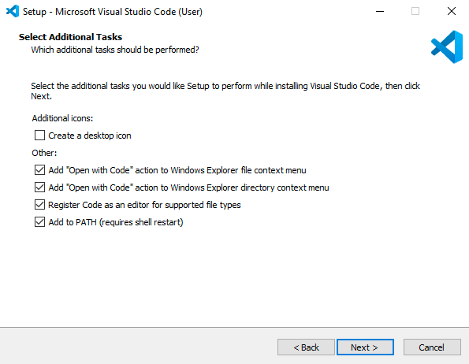
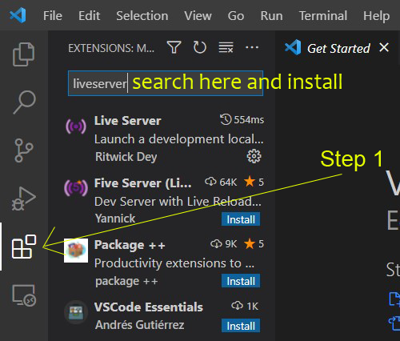

# Part 4
# Visual studio code (VSCode)
### Visual Studio Code is a code editor with support for development operations like debugging, task running, and version control.

<hr>

<h3 align="center"> click on the icon below to install VSCode directly for windows 10 and 11</h3>
<p align="center"> <kbd><a href="https://code.visualstudio.com/sha/download?build=stable&os=win32-x64-user"> </a></kbd>
<h3 align="center">Visual studio code</h3>

<hr>

- run the downloaded file `VSCodeUserSetup-x64.exe` and don't forget to check the boxes ( check the image below ) 

<br> <p align="center"><kbd> </kbd> </p>

- Then, Close your terminal or ubuntu to take effect and run ubuntu again
- in order to run the VSCode using ubuntu, we need to create a Demo project for testsing.

## To create a project follow these steps:
- from your UBUNTU run these commands:
```
mkdir Demo
cd Demo
```
then
```
code .
```
- when you hit `code .` you should see downloading... then your `VSCode` should be opened inside your current directory
- Note: if you see a `TRUST PROJECT` message please click trust and check the always trust box.

<hr>

# usefull extension for Visual studio code:
- please install the following VSCode extensions.
- `WSL` ( only for windows users - needed for the wsl environment and to enable code . command from ubuntu )
- `liveserver` ( used to create a live server for your project and check the project chenges )
- `ESLint` ( Eslint is a visual studio code extension for identifying and reporting on patterns and errors found in you code )
- `markdownlint` ( extend and enhance Visual Studio Code's built-in Markdown preview )

## How to install VSCODE extensions ( check the image below )
- Click on the extensions icon from the left side and search for the mentioned extentions above and install them.
<br> <p align="center"> <kbd> </kbd></p>

### Finally, let's make sure that everything is done as it should be:
- run the following commands
```
code --version
```
- you should get a result similar to this 
`1.74.3
899d4837hc95423fb7e10jnskjd52050e30ba3
x64`
- let's check the node version
```
node --version
```
- you should get a result like this `v18.13.0` or higher
- let's check the NPM version 
```
npm --version
```
- you should get a result like this `8.19.3` or higher
- let's check the git version
```
git --version
```
- you should get a result like this `git version 2.39.1` or higher

<a href="part3.md">Previous Page</a> | <a href="part5.md">PART 5 (Postgres)</a>

